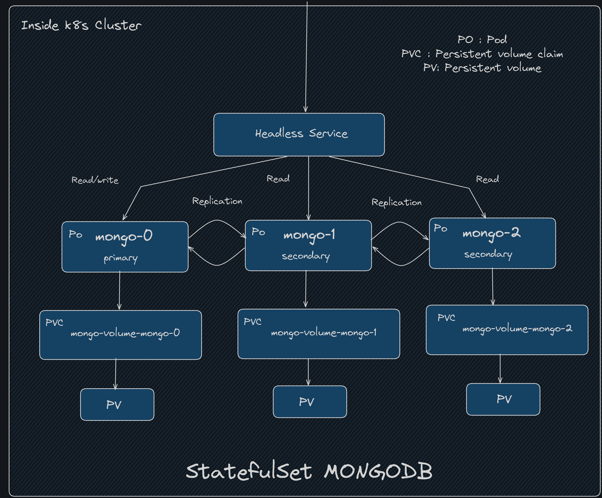

# K8s resources Architecture

## Why StatefulSet?

For stateful applications like databases, message brokers, or any applications that store data in persistent disk storage, deployment might not be a good choice. cause when we need to scale our application Deployment creates replicas of your pod and shares persistent storage. That will lead to data inconsistency when two pods write in the data storage at the same time. StatefulSet helps us to deploy Stateful applications in Kubernetes. StatefulSet uses individual persistent storage for each pod. Unlike deployment It won't create and delete pods in random order, StatefulSet creates and deletes pods in order. It guarantees a predictable and stable pod order. It uses master-slave architecture to maintain data consistency where a single replica which is the master, is responsible for managing and updating data, and the rest of the replicas known as slaves can only read the data.

## Why HeadlessService?

Using a headless service inside a StatefulSet in Kubernetes enables direct communication between individual pods while maintaining stable network identities and DNS-based service discovery. This is particularly useful for stateful applications that require predictable scaling, ordered communication, and direct connections between pods, such as databases or distributed systems.Unlike traditional services that perform load balancing across pod instances, a headless service does not perform load balancing.

here's an diagram of the architecture of statefulset and headless service in MongoDB which is designed in Excalidraw



# Steps to deploy MongoDB in K8s

## Manifest yml files

For configuring kubernetes resources we need to manifest
all k8s yml files

```
  kubectl apply -f .
```

### Checking Resource behaviour inside StatefulState

Checking pods

```
  kubectl get po
```

**we can notice one thing here after running this command every pods is getting created in an ordered way**

Increasing replicas

```
  kubectl scale sts mongo --replicas=9
```

**Now if we delete everything will be deleted in ordered way.First mongo-n will get deleted then mongo-(n-1) (suppose).**

for checking persistent volumeclaim

```
  kubectl get pvc
```

**Even after deletion persistent volume remain same**

for checking persistent volume

```
  kubectl get pv
```

and pvc

## replicaset config

StatefulSet dont provide Replication.But mongodb supports it internally To configure master-slave architecture we need to configure it.

first run mongoshell inside one replica

```
 kubectl exec -it mongo-0 -- mongo
```

after moving into this we have to run the code given below.

```
  rs.initiate({
        "_id" : "rs0",
        "members" : [
                {
                        "_id" : 0,
                        "host" : "mongo-0.mongo.default.svc.cluster.local:27017",
                },
                {
                        "_id" : 1,
                        "host" : "mongo-1.mongo.default.svc.cluster.local:27017",
                },
                {
                        "_id" : 2,
                        "host" : "mongo-2.mongo.default.svc.cluster.local:27017",
                }
        ]
})
```

So now mongo-0 pod is primary instance that can do operations read/write both.

setup secondary node

secondary nodes are meant to do only **read** operations. For defining a slave node we need to run this is command inside mongoshell of a other node that are not primary.

```
  rs.slaveOk()
```
#
